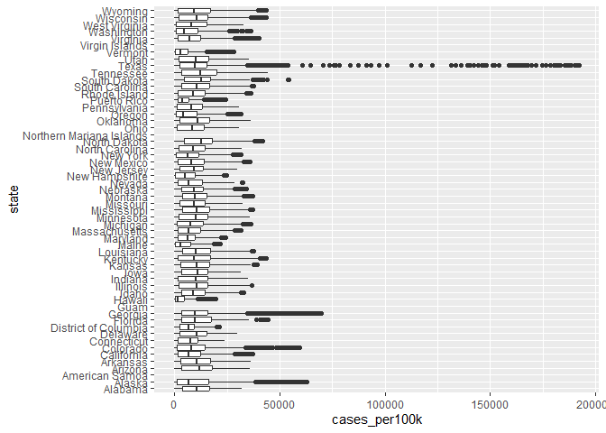
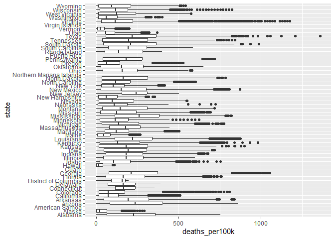
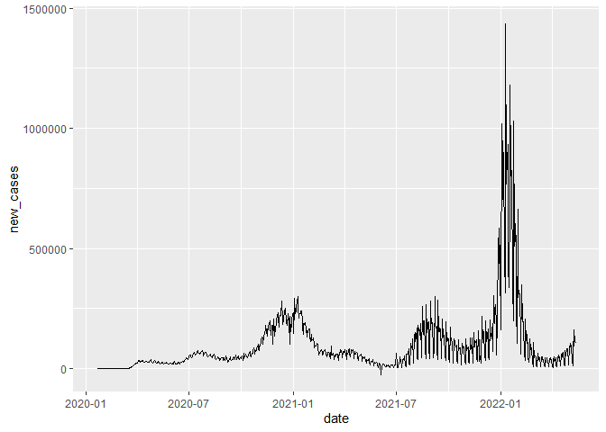
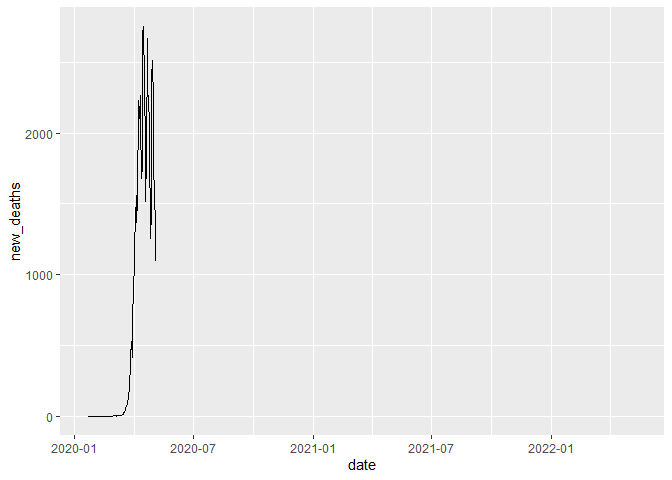
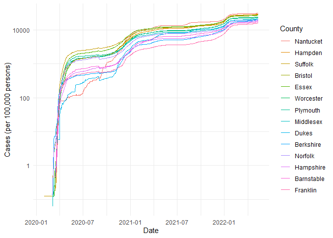

COVID-19
================
Karis Moon
2026-10-1

- [Grading Rubric](#grading-rubric)
  - [Individual](#individual)
  - [Submission](#submission)
- [The Big Picture](#the-big-picture)
- [Get the Data](#get-the-data)
  - [Navigating the Census Bureau](#navigating-the-census-bureau)
    - [**q1** Load Table `B01003` into the following tibble. Make sure
      the column names are
      `id, Geographic Area Name, Estimate!!Total, Margin of Error!!Total`.](#q1-load-table-b01003-into-the-following-tibble-make-sure-the-column-names-are-id-geographic-area-name-estimatetotal-margin-of-errortotal)
  - [Automated Download of NYT Data](#automated-download-of-nyt-data)
    - [**q2** Visit the NYT GitHub repo and find the URL for the **raw**
      US County-level data. Assign that URL as a string to the variable
      below.](#q2-visit-the-nyt-github-repo-and-find-the-url-for-the-raw-us-county-level-data-assign-that-url-as-a-string-to-the-variable-below)
- [Join the Data](#join-the-data)
  - [**q3** Process the `id` column of `df_pop` to create a `fips`
    column.](#q3-process-the-id-column-of-df_pop-to-create-a-fips-column)
  - [**q4** Join `df_covid` with `df_q3` by the `fips` column. Use the
    proper type of join to preserve *only* the rows in
    `df_covid`.](#q4-join-df_covid-with-df_q3-by-the-fips-column-use-the-proper-type-of-join-to-preserve-only-the-rows-in-df_covid)
- [Analyze](#analyze)
  - [Normalize](#normalize)
    - [**q5** Use the `population` estimates in `df_data` to normalize
      `cases` and `deaths` to produce per 100,000 counts \[3\]. Store
      these values in the columns `cases_per100k` and
      `deaths_per100k`.](#q5-use-the-population-estimates-in-df_data-to-normalize-cases-and-deaths-to-produce-per-100000-counts-3-store-these-values-in-the-columns-cases_per100k-and-deaths_per100k)
  - [Guided EDA](#guided-eda)
    - [**q6** Compute some summaries](#q6-compute-some-summaries)
    - [**q7** Find and compare the top
      10](#q7-find-and-compare-the-top-10)
  - [Self-directed EDA](#self-directed-eda)
    - [**q8** Drive your own ship: You’ve just put together a very rich
      dataset; you now get to explore! Pick your own direction and
      generate at least one punchline figure to document an interesting
      finding. I give a couple tips & ideas
      below:](#q8-drive-your-own-ship-youve-just-put-together-a-very-rich-dataset-you-now-get-to-explore-pick-your-own-direction-and-generate-at-least-one-punchline-figure-to-document-an-interesting-finding-i-give-a-couple-tips--ideas-below)
    - [Ideas](#ideas)
    - [Aside: Some visualization
      tricks](#aside-some-visualization-tricks)
    - [Geographic exceptions](#geographic-exceptions)
- [Notes](#notes)

*Purpose*: In this challenge, you’ll learn how to navigate the U.S.
Census Bureau website, programmatically download data from the internet,
and perform a county-level population-weighted analysis of current
COVID-19 trends. This will give you the base for a very deep
investigation of COVID-19, which we’ll build upon for Project 1.

<!-- include-rubric -->

# Grading Rubric

<!-- -------------------------------------------------- -->

Unlike exercises, **challenges will be graded**. The following rubrics
define how you will be graded, both on an individual and team basis.

## Individual

<!-- ------------------------- -->

| Category | Needs Improvement | Satisfactory |
|----|----|----|
| Effort | Some task **q**’s left unattempted | All task **q**’s attempted |
| Observed | Did not document observations, or observations incorrect | Documented correct observations based on analysis |
| Supported | Some observations not clearly supported by analysis | All observations clearly supported by analysis (table, graph, etc.) |
| Assessed | Observations include claims not supported by the data, or reflect a level of certainty not warranted by the data | Observations are appropriately qualified by the quality & relevance of the data and (in)conclusiveness of the support |
| Specified | Uses the phrase “more data are necessary” without clarification | Any statement that “more data are necessary” specifies which *specific* data are needed to answer what *specific* question |
| Code Styled | Violations of the [style guide](https://style.tidyverse.org/) hinder readability | Code sufficiently close to the [style guide](https://style.tidyverse.org/) |

## Submission

<!-- ------------------------- -->

Make sure to commit both the challenge report (`report.md` file) and
supporting files (`report_files/` folder) when you are done! Then submit
a link to Canvas. **Your Challenge submission is not complete without
all files uploaded to GitHub.**

``` r
library(tidyverse)
```

    ## Warning: package 'tidyverse' was built under R version 4.5.3

    ## Warning: package 'ggplot2' was built under R version 4.5.3

    ## Warning: package 'tibble' was built under R version 4.5.3

    ## Warning: package 'tidyr' was built under R version 4.5.3

    ## Warning: package 'readr' was built under R version 4.5.3

    ## Warning: package 'purrr' was built under R version 4.5.3

    ## Warning: package 'dplyr' was built under R version 4.5.3

    ## Warning: package 'stringr' was built under R version 4.5.3

    ## Warning: package 'forcats' was built under R version 4.5.3

    ## Warning: package 'lubridate' was built under R version 4.5.3

    ## ── Attaching core tidyverse packages ──────────────────────── tidyverse 2.0.0 ──
    ## ✔ dplyr     1.2.1     ✔ readr     2.2.0
    ## ✔ forcats   1.0.1     ✔ stringr   1.6.0
    ## ✔ ggplot2   4.0.3     ✔ tibble    3.3.1
    ## ✔ lubridate 1.9.5     ✔ tidyr     1.3.2
    ## ✔ purrr     1.2.2     
    ## ── Conflicts ────────────────────────────────────────── tidyverse_conflicts() ──
    ## ✖ dplyr::filter() masks stats::filter()
    ## ✖ dplyr::lag()    masks stats::lag()
    ## ℹ Use the conflicted package (<http://conflicted.r-lib.org/>) to force all conflicts to become errors

*Background*:
[COVID-19](https://en.wikipedia.org/wiki/Coronavirus_disease_2019) is
the disease caused by the virus SARS-CoV-2. In 2020 it became a global
pandemic, leading to huge loss of life and tremendous disruption to
society. The New York Times (as of writing) publishes up-to-date data on
the progression of the pandemic across the United States—we will study
these data in this challenge.

*Optional Readings*: I’ve found this [ProPublica
piece](https://www.propublica.org/article/how-to-understand-covid-19-numbers)
on “How to understand COVID-19 numbers” to be very informative!

# The Big Picture

<!-- -------------------------------------------------- -->

We’re about to go through *a lot* of weird steps, so let’s first fix the
big picture firmly in mind:

We want to study COVID-19 in terms of data: both case counts (number of
infections) and deaths. We’re going to do a county-level analysis in
order to get a high-resolution view of the pandemic. Since US counties
can vary widely in terms of their population, we’ll need population
estimates in order to compute infection rates (think back to the
`Titanic` challenge).

That’s the high-level view; now let’s dig into the details.

# Get the Data

<!-- -------------------------------------------------- -->

1.  County-level population estimates (Census Bureau)
2.  County-level COVID-19 counts (New York Times)

## Navigating the Census Bureau

<!-- ------------------------- -->

**Steps**: Our objective is to find the 2018 American Community
Survey\[1\] (ACS) Total Population estimates, disaggregated by counties.
To check your results, this is Table `B01003`.

1.  Go to [data.census.gov](data.census.gov).
2.  Scroll down and click `View Tables`.
3.  Apply filters to find the ACS **Total Population** estimates,
    disaggregated by counties. I used the filters:

- `Topics > Populations and People > Counts, Estimates, and Projections > Population Total`
- `Geography > County > All counties in United States`

5.  Select the **Total Population** table and click the `Download`
    button to download the data; make sure to select the 2018 5-year
    estimates.
6.  Unzip and move the data to your `challenges/data` folder.

- Note that the data will have a crazy-long filename like
  `ACSDT5Y2018.B01003_data_with_overlays_2020-07-26T094857.csv`. That’s
  because metadata is stored in the filename, such as the year of the
  estimate (`Y2018`) and my access date (`2020-07-26`). **Your filename
  will vary based on when you download the data**, so make sure to copy
  the filename that corresponds to what you downloaded!

### **q1** Load Table `B01003` into the following tibble. Make sure the column names are `id, Geographic Area Name, Estimate!!Total, Margin of Error!!Total`.

*Hint*: You will need to use the `skip` keyword when loading these data!

``` r
## TASK: Load the census bureau data with the following tibble name.
filename <- "./data/ACSDT5Y2018.B01003_2026-10-01T112825/ACSDT5Y2018.B01003-Data.csv"

## Load the data
df_pop <- 
  filename %>% 
  read_csv(skip = 1)
```

    ## New names:
    ## Rows: 3220 Columns: 5
    ## ── Column specification
    ## ──────────────────────────────────────────────────────── Delimiter: "," chr
    ## (3): Geography, Geographic Area Name, Margin of Error!!Total dbl (1):
    ## Estimate!!Total lgl (1): ...5
    ## ℹ Use `spec()` to retrieve the full column specification for this data. ℹ
    ## Specify the column types or set `show_col_types = FALSE` to quiet this message.
    ## • `` -> `...5`

``` r
df_pop <-
  df_pop %>% 
  select(c(-"...5"))
names(df_pop)[names(df_pop) == 'Geography'] <- 'id'

df_pop %>% 
  glimpse()
```

    ## Rows: 3,220
    ## Columns: 4
    ## $ id                       <chr> "0500000US01001", "0500000US01003", "0500000U…
    ## $ `Geographic Area Name`   <chr> "Autauga County, Alabama", "Baldwin County, A…
    ## $ `Estimate!!Total`        <dbl> 55200, 208107, 25782, 22527, 57645, 10352, 20…
    ## $ `Margin of Error!!Total` <chr> "*****", "*****", "*****", "*****", "*****", …

*Note*: You can find information on 1-year, 3-year, and 5-year estimates
[here](https://www.census.gov/programs-surveys/acs/guidance/estimates.html).
The punchline is that 5-year estimates are more reliable but less
current.

## Automated Download of NYT Data

<!-- ------------------------- -->

ACS 5-year estimates don’t change all that often, but the COVID-19 data
are changing rapidly. To that end, it would be nice to be able to
*programmatically* download the most recent data for analysis; that way
we can update our analysis whenever we want simply by re-running our
notebook. This next problem will have you set up such a pipeline.

The New York Times is publishing up-to-date data on COVID-19 on
[GitHub](https://github.com/nytimes/covid-19-data).

### **q2** Visit the NYT [GitHub](https://github.com/nytimes/covid-19-data) repo and find the URL for the **raw** US County-level data. Assign that URL as a string to the variable below.

``` r
## TASK: Find the URL for the NYT covid-19 county-level data
url_counties <- "https://raw.githubusercontent.com/nytimes/covid-19-data/master/us-counties.csv"
```

Once you have the url, the following code will download a local copy of
the data, then load the data into R.

``` r
## NOTE: No need to change this; just execute
## Set the filename of the data to download
filename_nyt <- "./data/nyt_counties.csv"

## Download the data locally
curl::curl_download(
        url_counties,
        destfile = filename_nyt
      )

## Loads the downloaded csv
df_covid <- read_csv(filename_nyt)
```

    ## Rows: 2502832 Columns: 6
    ## ── Column specification ────────────────────────────────────────────────────────
    ## Delimiter: ","
    ## chr  (3): county, state, fips
    ## dbl  (2): cases, deaths
    ## date (1): date
    ## 
    ## ℹ Use `spec()` to retrieve the full column specification for this data.
    ## ℹ Specify the column types or set `show_col_types = FALSE` to quiet this message.

You can now re-run the chunk above (or the entire notebook) to pull the
most recent version of the data. Thus you can periodically re-run this
notebook to check in on the pandemic as it evolves.

*Note*: You should feel free to copy-paste the code above for your own
future projects!

# Join the Data

<!-- -------------------------------------------------- -->

To get a sense of our task, let’s take a glimpse at our two data
sources.

``` r
## NOTE: No need to change this; just execute
df_pop %>% glimpse
```

    ## Rows: 3,220
    ## Columns: 4
    ## $ id                       <chr> "0500000US01001", "0500000US01003", "0500000U…
    ## $ `Geographic Area Name`   <chr> "Autauga County, Alabama", "Baldwin County, A…
    ## $ `Estimate!!Total`        <dbl> 55200, 208107, 25782, 22527, 57645, 10352, 20…
    ## $ `Margin of Error!!Total` <chr> "*****", "*****", "*****", "*****", "*****", …

``` r
df_covid %>% glimpse
```

    ## Rows: 2,502,832
    ## Columns: 6
    ## $ date   <date> 2020-01-21, 2020-01-22, 2020-01-23, 2020-01-24, 2020-01-24, 20…
    ## $ county <chr> "Snohomish", "Snohomish", "Snohomish", "Cook", "Snohomish", "Or…
    ## $ state  <chr> "Washington", "Washington", "Washington", "Illinois", "Washingt…
    ## $ fips   <chr> "53061", "53061", "53061", "17031", "53061", "06059", "17031", …
    ## $ cases  <dbl> 1, 1, 1, 1, 1, 1, 1, 1, 1, 1, 1, 1, 1, 1, 1, 1, 1, 1, 1, 1, 1, …
    ## $ deaths <dbl> 0, 0, 0, 0, 0, 0, 0, 0, 0, 0, 0, 0, 0, 0, 0, 0, 0, 0, 0, 0, 0, …

To join these datasets, we’ll need to use [FIPS county
codes](https://en.wikipedia.org/wiki/FIPS_county_code).\[2\] The last
`5` digits of the `id` column in `df_pop` is the FIPS county code, while
the NYT data `df_covid` already contains the `fips`.

### **q3** Process the `id` column of `df_pop` to create a `fips` column.

``` r
## TASK: Create a `fips` column by extracting the county code
df_q3 <- 
  df_pop %>% 
  mutate(
    fips = str_sub(id, -5)
  )
```

Use the following test to check your answer.

``` r
## NOTE: No need to change this
## Check known county
assertthat::assert_that(
              (df_q3 %>%
              filter(str_detect(`Geographic Area Name`, "Autauga County")) %>%
              pull(fips)) == "01001"
            )
```

    ## [1] TRUE

``` r
print("Very good!")
```

    ## [1] "Very good!"

### **q4** Join `df_covid` with `df_q3` by the `fips` column. Use the proper type of join to preserve *only* the rows in `df_covid`.

``` r
## TASK: Join df_covid and df_q3 by fips.
df_q4 <- 
  df_covid %>% 
  left_join(
    df_q3,
    by = join_by(fips)
  )
```

Use the following test to check your answer.

``` r
## NOTE: No need to change this
if (!any(df_q4 %>% pull(fips) %>% str_detect(., "02105"), na.rm = TRUE)) {
  assertthat::assert_that(TRUE)
} else {
  print(str_c(
    "Your df_q4 contains a row for the Hoonah-Angoon Census Area (AK),",
    "which is not in df_covid. You used the incorrect join type.",
    sep = " "
  ))
  assertthat::assert_that(FALSE)
}
```

    ## [1] TRUE

``` r
if (any(df_q4 %>% pull(fips) %>% str_detect(., "78010"), na.rm = TRUE)) {
  assertthat::assert_that(TRUE)
} else {
  print(str_c(
    "Your df_q4 does not include St. Croix, US Virgin Islands,",
    "which is in df_covid. You used the incorrect join type.",
    sep = " "
  ))
  assertthat::assert_that(FALSE)
}
```

    ## [1] TRUE

``` r
print("Very good!")
```

    ## [1] "Very good!"

For convenience, I down-select some columns and produce more convenient
column names.

``` r
## NOTE: No need to change; run this to produce a more convenient tibble
df_data <-
  df_q4 %>%
  select(
    date,
    county,
    state,
    fips,
    cases,
    deaths,
    population = `Estimate!!Total`
  )
```

# Analyze

<!-- -------------------------------------------------- -->

Now that we’ve done the hard work of loading and wrangling the data, we
can finally start our analysis. Our first step will be to produce county
population-normalized cases and death counts. Then we will explore the
data.

## Normalize

<!-- ------------------------- -->

### **q5** Use the `population` estimates in `df_data` to normalize `cases` and `deaths` to produce per 100,000 counts \[3\]. Store these values in the columns `cases_per100k` and `deaths_per100k`.

``` r
## TASK: Normalize cases and deaths
df_normalized <-
  df_data %>% 
  mutate(
    cases_per100k = cases / population * 100000,
    deaths_per100k = deaths / population * 100000
  )
```

You may use the following test to check your work.

``` r
## NOTE: No need to change this
## Check known county data
if (any(df_normalized %>% pull(date) %>% str_detect(., "2020-01-21"))) {
  assertthat::assert_that(TRUE)
} else {
  print(str_c(
    "Date 2020-01-21 not found; did you download the historical data (correct),",
    "or just the most recent data (incorrect)?",
    sep = " "
  ))
  assertthat::assert_that(FALSE)
}
```

    ## [1] TRUE

``` r
if (any(df_normalized %>% pull(date) %>% str_detect(., "2022-05-13"))) {
  assertthat::assert_that(TRUE)
} else {
  print(str_c(
    "Date 2022-05-13 not found; did you download the historical data (correct),",
    "or a single year's data (incorrect)?",
    sep = " "
  ))
  assertthat::assert_that(FALSE)
}
```

    ## [1] TRUE

``` r
## Check datatypes
assertthat::assert_that(is.numeric(df_normalized$cases))
```

    ## [1] TRUE

``` r
assertthat::assert_that(is.numeric(df_normalized$deaths))
```

    ## [1] TRUE

``` r
assertthat::assert_that(is.numeric(df_normalized$population))
```

    ## [1] TRUE

``` r
assertthat::assert_that(is.numeric(df_normalized$cases_per100k))
```

    ## [1] TRUE

``` r
assertthat::assert_that(is.numeric(df_normalized$deaths_per100k))
```

    ## [1] TRUE

``` r
## Check that normalization is correct
assertthat::assert_that(
              abs(df_normalized %>%
               filter(
                 str_detect(county, "Snohomish"),
                 date == "2020-01-21"
               ) %>%
              pull(cases_per100k) - 0.127) < 1e-3
            )
```

    ## [1] TRUE

``` r
assertthat::assert_that(
              abs(df_normalized %>%
               filter(
                 str_detect(county, "Snohomish"),
                 date == "2020-01-21"
               ) %>%
              pull(deaths_per100k) - 0) < 1e-3
            )
```

    ## [1] TRUE

``` r
print("Excellent!")
```

    ## [1] "Excellent!"

## Guided EDA

<!-- ------------------------- -->

Before turning you loose, let’s complete a couple guided EDA tasks.

### **q6** Compute some summaries

Compute the mean and standard deviation for `cases_per100k` and
`deaths_per100k`. *Make sure to carefully choose **which rows** to
include in your summaries,* and justify why!

``` r
## TASK: Compute mean and sd for cases_per100k and deaths_per100k
df_normalized %>% 
  filter(date == "2022-01-15") %>% 
  summary()
```

    ##       date               county             state               fips          
    ##  Min.   :2022-01-15   Length:3252        Length:3252        Length:3252       
    ##  1st Qu.:2022-01-15   Class :character   Class :character   Class :character  
    ##  Median :2022-01-15   Mode  :character   Mode  :character   Mode  :character  
    ##  Mean   :2022-01-15                                                           
    ##  3rd Qu.:2022-01-15                                                           
    ##  Max.   :2022-01-15                                                           
    ##                                                                               
    ##      cases             deaths          population       cases_per100k  
    ##  Min.   :      0   Min.   :    0.0   Min.   :      75   Min.   : 1333  
    ##  1st Qu.:   2087   1st Qu.:   34.0   1st Qu.:   11226   1st Qu.:16947  
    ##  Median :   5048   Median :   82.0   Median :   25909   Median :19856  
    ##  Mean   :  20134   Mean   :  267.8   Mean   :   98985   Mean   :19525  
    ##  3rd Qu.:  13083   3rd Qu.:  196.0   3rd Qu.:   66385   3rd Qu.:22120  
    ##  Max.   :2214368   Max.   :36509.0   Max.   :10098052   Max.   :64706  
    ##                    NA's   :78        NA's   :41         NA's   :41     
    ##  deaths_per100k  
    ##  Min.   :   0.0  
    ##  1st Qu.: 219.2  
    ##  Median : 306.6  
    ##  Mean   : 315.8  
    ##  3rd Qu.: 401.8  
    ##  Max.   :1208.5  
    ##  NA's   :119

- Which rows did you pick?
  - (Your response here)
  - January 15, 2022
- Why?
  - (Your response here)
  - I didn’t want to get the same county multiple times, so I picked a
    date
  - Google said that’s when Covid had peak cases

### **q7** Find and compare the top 10

Find the top 10 counties in terms of `cases_per100k`, and the top 10 in
terms of `deaths_per100k`. Report the population of each county along
with the per-100,000 counts. Compare the counts against the mean values
you found in q6. Note any observations.

``` r
## TASK: Find the top 10 max cases_per100k counties; report populations as well

df_normalized %>% 
  arrange(desc(cases_per100k)) %>% 
  distinct(fips, .keep_all = TRUE) %>% 
  select(date, county, state, cases_per100k, population, everything())
```

    ## # A tibble: 3,221 × 9
    ##    date       county           state cases_per100k population fips  cases deaths
    ##    <date>     <chr>            <chr>         <dbl>      <dbl> <chr> <dbl>  <dbl>
    ##  1 2022-05-12 Loving           Texas       192157.        102 48301   196      1
    ##  2 2022-05-11 Chattahoochee    Geor…        69527.      10767 13053  7486     22
    ##  3 2022-05-11 Nome Census Area Alas…        62922.       9925 02180  6245      5
    ##  4 2022-05-11 Northwest Arcti… Alas…        62542.       7734 02188  4837     13
    ##  5 2022-05-13 Crowley          Colo…        59449.       5630 08025  3347     30
    ##  6 2022-05-11 Bethel Census A… Alas…        57439.      18040 02050 10362     41
    ##  7 2022-03-30 Dewey            Sout…        54317.       5779 46041  3139     42
    ##  8 2022-05-12 Dimmit           Texas        54019.      10663 48127  5760     51
    ##  9 2022-05-12 Jim Hogg         Texas        50133.       5282 48247  2648     22
    ## 10 2022-05-11 Kusilvak Census… Alas…        49817.       8198 02158  4084     14
    ## # ℹ 3,211 more rows
    ## # ℹ 1 more variable: deaths_per100k <dbl>

``` r
## TASK: Find the top 10 deaths_per100k counties; report populations as well
df_normalized %>% 
  arrange(desc(deaths_per100k)) %>% 
  distinct(fips, .keep_all = TRUE) %>% 
  select(date, county, state, deaths_per100k, population, everything())
```

    ## # A tibble: 3,221 × 9
    ##    date       county          state deaths_per100k population fips  cases deaths
    ##    <date>     <chr>           <chr>          <dbl>      <dbl> <chr> <dbl>  <dbl>
    ##  1 2022-02-19 McMullen        Texas          1360.        662 48311   166      9
    ##  2 2022-04-27 Galax city      Virg…          1175.       6638 51640  2551     78
    ##  3 2022-03-10 Motley          Texas          1125.       1156 48345   271     13
    ##  4 2022-04-20 Hancock         Geor…          1054.       8535 13141  1577     90
    ##  5 2022-04-19 Emporia city    Virg…          1022.       5381 51595  1169     55
    ##  6 2022-04-27 Towns           Geor…          1016.      11417 13281  2396    116
    ##  7 2022-02-14 Jerauld         Sout…           986.       2029 46073   404     20
    ##  8 2022-03-04 Loving          Texas           980.        102 48301   165      1
    ##  9 2022-02-03 Robertson       Kent…           980.       2143 21201   570     21
    ## 10 2022-05-05 Martinsville c… Virg…           946.      13101 51690  3452    124
    ## # ℹ 3,211 more rows
    ## # ℹ 1 more variable: cases_per100k <dbl>

**Observations**:

- (Note your observations here!)

Top cases per 100K

| County                   | State        | cases_per100k | Population |
|--------------------------|--------------|---------------|------------|
| Loving                   | Texas        | 192156.86     | 102        |
| Chattahoochee            | Georgia      | 69527.26      | 10767      |
| Nome Census Area         | Alaska       | 62921.91      | 9925       |
| Northwest Arctic Borough | Alaska       | 62542.02      | 7734       |
| Crowley                  | Colorado     | 59449.38      | 5630       |
| Bethel Census Area       | Alaska       | 57439.02      | 18040      |
| Dewey                    | South Dakota | 54317.36      | 5779       |
| Dimmit                   | Texas        | 54018.57      | 10663      |
| Jim Hogg                 | Texas        | 50132.53      | 5282       |
| Kusilvak Census Area     | Alaska       | 49817.03      | 8198       |

Top deaths per 100K

| County            | State        | deaths_per100k | Population |
|-------------------|--------------|----------------|------------|
| McMullen          | Texas        | 1359.5166      | 662        |
| Galax city        | Virginia     | 1175.0527      | 6638       |
| Motley            | Texas        | 1124.5675      | 1156       |
| Hancock           | Georgia      | 1054.4815      | 8535       |
| Emporia city      | Virginia     | 1022.1148      | 5381       |
| Towns             | Georgia      | 1016.0287      | 11417      |
| Jerauld           | South Dakota | 985.7072       | 2029       |
| Loving            | Texas        | 980.3922       | 102        |
| Robertson         | Kentucky     | 979.9347       | 2143       |
| Martinsville city | Virginia     | 946.4926       | 13101      |

- These are all smaller counties

- When did these “largest values” occur?

  - All the top cases per 100K happened in May 2022, except one in March
    2022
  - All the top deaths per 100K happened in winter to early spring of
    2022

## Self-directed EDA

<!-- ------------------------- -->

### **q8** Drive your own ship: You’ve just put together a very rich dataset; you now get to explore! Pick your own direction and generate at least one punchline figure to document an interesting finding. I give a couple tips & ideas below:

### Ideas

<!-- ------------------------- -->

- Look for outliers.
- Try web searching for news stories in some of the outlier counties.
- Investigate relationships between county population and counts.
- Do a deep-dive on counties that are important to you (e.g. where you
  or your family live).
- Fix the *geographic exceptions* noted below to study New York City.
- Your own idea!

**DO YOUR OWN ANALYSIS HERE**

``` r
df_normalized %>% 
  ggplot(aes(state,cases_per100k)) +
  geom_boxplot() +
  coord_flip()
```

    ## Warning: Removed 28822 rows containing non-finite outside the scale range
    ## (`stat_boxplot()`).

<!-- -->

``` r
df_normalized %>% 
  ggplot(aes(state,deaths_per100k)) +
  geom_boxplot() +
  coord_flip()
```

    ## Warning: Removed 86427 rows containing non-finite outside the scale range
    ## (`stat_boxplot()`).

<!-- -->

``` r
df_new <-
  df_normalized %>% 
  group_by(date) %>% 
  summarize(
    total_cases = sum(cases),
    total_deaths = sum(deaths)
  ) %>%
  mutate(
    new_cases = total_cases - lag(total_cases),
    new_deaths = total_deaths - lag(total_deaths)
  )

df_new %>% 
  ggplot(aes(date, new_cases)) +
  geom_line()
```

    ## Warning: Removed 1 row containing missing values or values outside the scale range
    ## (`geom_line()`).

<!-- -->

``` r
df_new %>% 
  ggplot(aes(date, new_deaths)) +
  geom_line()
```

    ## Warning: Removed 740 rows containing missing values or values outside the scale range
    ## (`geom_line()`).

<!-- -->

``` r
df_new %>% 
  filter(new_cases > 1250000)
```

    ## # A tibble: 1 × 5
    ##   date       total_cases total_deaths new_cases new_deaths
    ##   <date>           <dbl>        <dbl>     <dbl>      <dbl>
    ## 1 2022-01-10    61600909           NA   1433977         NA

What happened on January 10, 2022?

``` r
df_new_per_day <-
  df_normalized %>% 
  group_by(county) %>%
  arrange(date) %>%
  mutate(new_cases = cases - lag(cases)) %>% 
  select(date, county, state, cases, new_cases, everything())
df_new_per_day
```

    ## # A tibble: 2,502,832 × 10
    ## # Groups:   county [1,932]
    ##    date       county state cases new_cases fips  deaths population cases_per100k
    ##    <date>     <chr>  <chr> <dbl>     <dbl> <chr>  <dbl>      <dbl>         <dbl>
    ##  1 2020-01-21 Snoho… Wash…     1        NA 53061      0     786620       0.127  
    ##  2 2020-01-22 Snoho… Wash…     1         0 53061      0     786620       0.127  
    ##  3 2020-01-23 Snoho… Wash…     1         0 53061      0     786620       0.127  
    ##  4 2020-01-24 Cook   Illi…     1        NA 17031      0    5223719       0.0191 
    ##  5 2020-01-24 Snoho… Wash…     1         0 53061      0     786620       0.127  
    ##  6 2020-01-25 Orange Cali…     1        NA 06059      0    3164182       0.0316 
    ##  7 2020-01-25 Cook   Illi…     1         0 17031      0    5223719       0.0191 
    ##  8 2020-01-25 Snoho… Wash…     1         0 53061      0     786620       0.127  
    ##  9 2020-01-26 Maric… Ariz…     1        NA 04013      0    4253913       0.0235 
    ## 10 2020-01-26 Los A… Cali…     1        NA 06037      0   10098052       0.00990
    ## # ℹ 2,502,822 more rows
    ## # ℹ 1 more variable: deaths_per100k <dbl>

``` r
df_new_per_day %>% 
  filter(date == '2022-01-10') %>% 
  arrange(desc(new_cases))
```

    ## # A tibble: 3,251 × 10
    ## # Groups:   county [1,930]
    ##    date       county    state          cases new_cases fips  deaths population
    ##    <date>     <chr>     <chr>          <dbl>     <dbl> <chr>  <dbl>      <dbl>
    ##  1 2022-01-10 Cook      Illinois      947175    943203 17031  12844    5223719
    ##  2 2022-01-10 Harris    Texas         752947    748286 48201   9821    4602523
    ##  3 2022-01-10 Dallas    Texas         481528    478664 48113   5817    2586552
    ##  4 2022-01-10 Orange    California    422625    417582 06059   5908    3164182
    ##  5 2022-01-10 Clark     Nevada        416544    415219 32003   6544    2141574
    ##  6 2022-01-10 Nassau    New York      354032    337356 36059   3482    1356564
    ##  7 2022-01-10 Wayne     Michigan      319788    315656 26163   6672    1761382
    ##  8 2022-01-10 King      Washington    248777    248747 53033   2198    2163257
    ##  9 2022-01-10 Middlesex Massachusetts 254872    232999 25017   4179    1595192
    ## 10 2022-01-10 Franklin  Ohio          235422    221970 39049   1973    1275333
    ## # ℹ 3,241 more rows
    ## # ℹ 2 more variables: cases_per100k <dbl>, deaths_per100k <dbl>

``` r
df_new_per_day %>% 
  filter(date == '2022-01-09') %>% 
  arrange(desc(new_cases))
```

    ## # A tibble: 3,251 × 10
    ## # Groups:   county [1,930]
    ##    date       county       state         cases new_cases fips  deaths population
    ##    <date>     <chr>        <chr>         <dbl>     <dbl> <chr>  <dbl>      <dbl>
    ##  1 2022-01-09 Cook         Illinois     917379    913547 17031  12757    5223719
    ##  2 2022-01-09 Harris       Texas        745996    741657 48201   9821    4602523
    ##  3 2022-01-09 Dallas       Texas        477343    474483 48113   5817    2586552
    ##  4 2022-01-09 Clark        Nevada       401096    399771 32003   6529    2141574
    ##  5 2022-01-09 Orange       California   397186    392143 06059   5906    3164182
    ##  6 2022-01-09 Nassau       New York     350265    333589 36059   3472    1356564
    ##  7 2022-01-09 Wayne        Michigan     310944    306812 26163   6661    1761382
    ##  8 2022-01-09 King         Washington   229984    229955 53033   2199    2163257
    ##  9 2022-01-09 Middlesex    Massachuset… 241111    220135 25017   4166    1595192
    ## 10 2022-01-09 Hillsborough Florida      290614    220101 12057   3140    1378883
    ## # ℹ 3,241 more rows
    ## # ℹ 2 more variables: cases_per100k <dbl>, deaths_per100k <dbl>

``` r
df_new_per_day %>% 
  filter(date == '2022-01-01') %>% 
  arrange(desc(new_cases))
```

    ## # A tibble: 3,251 × 10
    ## # Groups:   county [1,930]
    ##    date       county       state       cases new_cases fips  deaths population
    ##    <date>     <chr>        <chr>       <dbl>     <dbl> <chr>  <dbl>      <dbl>
    ##  1 2022-01-01 Cook         Illinois   821472    817729 17031  12541    5223719
    ##  2 2022-01-01 Harris       Texas      651970    647811 48201   9740    4602523
    ##  3 2022-01-01 Dallas       Texas      436400    433700 48113   5765    2586552
    ##  4 2022-01-01 Clark        Nevada     378138    376859 32003   6461    2141574
    ##  5 2022-01-01 Orange       California 358569    353871 06059   5890    3164182
    ##  6 2022-01-01 Nassau       New York   302366    286562 36059   3412    1356564
    ##  7 2022-01-01 Wayne        Michigan   277722    273730 26163   6484    1761382
    ##  8 2022-01-01 Hillsborough Florida    268504    203323 12057   3139    1378883
    ##  9 2022-01-01 King         Washington 200875    200848 53033   2164    2163257
    ## 10 2022-01-01 Franklin     Ohio       208679    197190 39049   1955    1275333
    ## # ℹ 3,241 more rows
    ## # ℹ 2 more variables: cases_per100k <dbl>, deaths_per100k <dbl>

It looks like there weren’t any specific counties with an outlying
increase of cases, rather the cases had a peak on that date. Looking at
the news, it was because of the Omicron variant which caused the spike
visible on the graph starting in December.

### Aside: Some visualization tricks

<!-- ------------------------- -->

These data get a little busy, so it’s helpful to know a few `ggplot`
tricks to help with the visualization. Here’s an example focused on
Massachusetts.

``` r
## NOTE: No need to change this; just an example
df_normalized %>%
  filter(
    state == "Massachusetts", # Focus on Mass only
    !is.na(fips), # fct_reorder2 can choke with missing data
  ) %>%

  ggplot(
    aes(date, cases_per100k, color = fct_reorder2(county, date, cases_per100k))
  ) +
  geom_line() +
  scale_y_log10() +
  scale_color_discrete(name = "County") +
  theme_minimal() +
  labs(
    x = "Date",
    y = "Cases (per 100,000 persons)"
  )
```

<!-- -->

*Tricks*:

- I use `fct_reorder2` to *re-order* the color labels such that the
  color in the legend on the right is ordered the same as the vertical
  order of rightmost points on the curves. This makes it easier to
  reference the legend.
- I manually set the `name` of the color scale in order to avoid
  reporting the `fct_reorder2` call.
- I use `scales::label_number_si` to make the vertical labels more
  readable.
- I use `theme_minimal()` to clean up the theme a bit.
- I use `labs()` to give manual labels.

### Geographic exceptions

<!-- ------------------------- -->

The NYT repo documents some [geographic
exceptions](https://github.com/nytimes/covid-19-data#geographic-exceptions);
the data for New York, Kings, Queens, Bronx and Richmond counties are
consolidated under “New York City” *without* a fips code. Thus the
normalized counts in `df_normalized` are `NA`. To fix this, you would
need to merge the population data from the New York City counties, and
manually normalize the data.

# Notes

<!-- -------------------------------------------------- -->

\[1\] The census used to have many, many questions, but the ACS was
created in 2010 to remove some questions and shorten the census. You can
learn more in [this wonderful visual
history](https://pudding.cool/2020/03/census-history/) of the census.

\[2\] FIPS stands for [Federal Information Processing
Standards](https://en.wikipedia.org/wiki/Federal_Information_Processing_Standards);
these are computer standards issued by NIST for things such as
government data.

\[3\] Demographers often report statistics not in percentages (per 100
people), but rather in per 100,000 persons. This is [not always the
case](https://stats.stackexchange.com/questions/12810/why-do-demographers-give-rates-per-100-000-people)
though!
